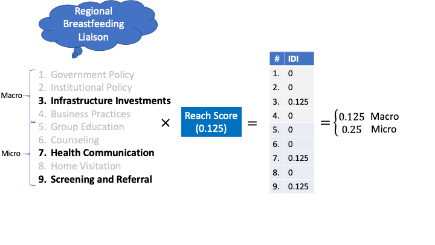
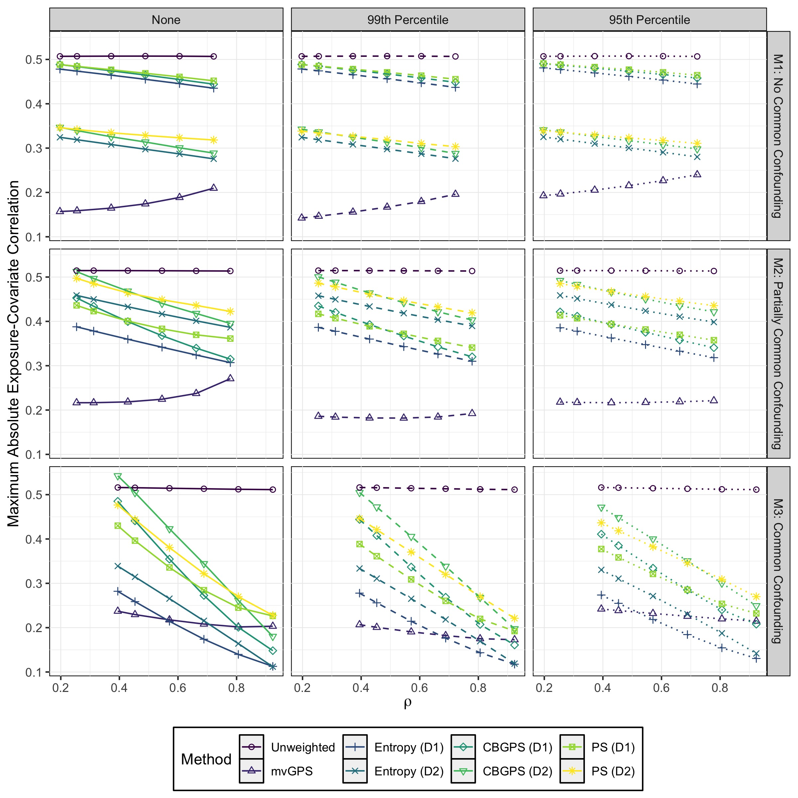

class: title-slide

# Methods for Estimating Causal Effects for Multivariate Continuous Exposures

## Justin Williams

### 2020-11-05

<div class="ucla-seal-left"></div>
<div class="fsph-logo-right"></div>

---

```{r load_refs, echo=FALSE, cache=FALSE, message=FALSE, warning=FALSE}
library(RefManageR)
BibOptions(check.entries = FALSE,
           bib.style = "authoryear",
           cite.style = "authoryear",
           style = "markdown",
           hyperlink = FALSE,
           dashed = FALSE,
           max.names = 4)
myBib <- ReadBib("assets/gps_dissertation.bib", check = FALSE)
```

```{r xaringanExtra, echo=FALSE}
xaringanExtra::use_xaringan_extra("panelset")
```

```{r xaringan-tile-view, echo=FALSE}
xaringanExtra::use_tile_view()
```

```{r xaringan-panelset, echo=FALSE}
options(htmltools.dir.version = FALSE)
xaringanExtra::use_panelset()
```


class: center, middle, inverse
# Introduction
---
# What If...

.pull-left[
.small[
- Q: "*What if* the batter had swung?"

- "What-if" questions require us to think causally and imagine unobserved potential outcomes

- Inability to observe all potential outcomes
    - Fundamental problem of causal inference `r Citep(myBib,"holland1986")`
    - Third rung of ladder of causation `r Citep(myBib,"pearl_book_of_why")`
]
]
.pull-right[
<video width="560" height="315" controls>
    <source src="https://sporty-clips.mlb.com/8b0a7a89-c0af-40a7-aa57-032817d03177.mp4" type="video/mp4">
</video>
]
---
# Background

- Gold standard for answering causal questions is the randomized clinical trial
    - Balance on known and unknown confounders
- However, using the gold standard RCT may not be possible in real world settings
    - Unrealistic, e.g., surgery vs. placebo
    - Unethical, e.g., forcing patients to smoke

- How to estimate causal effects without randomization?
    - Exposure may be systematically related to outcome

- Utilize propensity score method `r Citep(myBib,"rosenbaum_propensity")`

> .small[.dodger-blue[Propensity score] = Probability of receiving exposure given set of confounders]

\begin{align}
\Pr(D=1\mid C)
\end{align}

---
# Brief History of Propensity Score

**Estimation**
1. Originally proposed by `r Citet(myBib,"rosenbaum_propensity")`
    - Handled binary exposure only, i.e., exposed vs. control
1. Methods extended to categorical, or multiple, treatments by `r Citet(myBib,"imbens_dose_resp")`
    - Term "generalized propensity score" (GPS) is introduced
1. Adaptions for continuous treatments introduced by `r Citet(myBib, c("hirano_continuous", "imai_causalGPS"))`
    - Use Gaussian densities for estimating probability of exposure level

**Bias Removal**
1. Covariate adjustment
1. Subclassification/stratification
1. Matching
1. Inverse probability of treatment weighting (IPTW)

???
- Throughout we use GPS to refer to continuous rather than categorical treatment
---
# Propensity Score with Continuous Exposure
.small[
- Popular applications
    - *Economics*: difference in employment outcomes due to length of time in job
    training program `r Citep(myBib, c("flores2012", "kluve_gps"))`
    - *Health outcomes*: childhood obesity and duration of breastfeeding `r Citep(myBib, "jiang2013")`
    - *Education policy*: transfer rate and number of credits taken `r Citep(myBib, "doyle2011")`
- Methodology development
    - SuperLearner `r Citep(myBib, "kreif_gps_ml")`
    - Kernel density estimation `r Citep(myBib, "flores2012")`
    - Gradient boosting `r Citep(myBib, "zhu_boosting")`
    - Covariate balancing generalized propensity score (CBGPS) `r Citep(myBib, "fong2018")`
    - Entropy balancing `r Citep(myBib, c("vegetabile2020nonparametric", "tbbicke2020entropy"))`
]
---
# Multivariate Continuous Exposures

- All methodological development has focused on single univariate continuous exposure
    - Multiple exposures noted only briefly in `r Citet(myBib, "imai_causalGPS")`
- Need for methods to handle multivariate exposures
    - Identify potential combination therapies from observational studies
        - COVID-19 treatments `r Citep(myBib, c("covid_tx_review"))`
    - Estimate combined effects of childhood obesity intervention programs in the community
- Challenges:
    - Define multivariate densities for generalized propensity score
    - Multiple sets of confounders
    - Correlation of exposures
    - Assessing high dimensional balance
    - Properly defining estimable multivariate region for inference
---
class: center, middle, inverse
# Motivating Example
---
# Project Goal
- High obesity rates of low-income 2-5 year olds in Los Angeles County `r Citep(myBib, "phfewic")`
    - 20% classified as obese during period from 2003-2009

- Estimate causal effects of non-randomly assigned obesity interventions on WIC preschool-aged child obesity rates
    - Early Childhood Obesity Systems Science (ECOSyS) study funded by NIH
[R01 HD072296](https://grantome.com/grant/NIH/R01-HD072296-01A1)


- Intervention Period: 2010-2016

- Exposure:
    - WIC intervention programs

- Outcome:
    - Change in obesity prevalence from post- to pre-intervention measured at census tracts

<div class="wic-logo-right"></div>
???
- In 2018 WIC served approximately half of all children under age 5 in Los Angeles County
---

# Outcome Data

.pull-left[
.small[
- Source:
    - WIC administrative data
        - Part of the [WIC Data Mining Project](https://lawicdata.org)
    - Pulled from 2007-2016
- Quantification:
    - Obesity prevalence at census tracts
    - Include only census tracts with at least 30 WIC children for all years
        - Total of 1079 included
    - Pre-intervention=2007-2009
    - Post-intervention=2012-2016
        - Allow for lagged treatment effect
    $$Y=\bar{p}_{post}-\bar{p}_{pre}$$
]
]
.pull-right[

```{r analysis_units, echo=FALSE, out.width="95%", fig.align="center"}

```
]
---

# Exposure Data

.pull-left[
.small[
- Source:
    - Interviews with WIC staff
    - Total of 32 programs identified across 7 WIC agencies in LAC
    - Targeted 8 regions during interview process
- Quantification:
    1. Categorize intervention strategies used by program
    2. Construct adapted "intervention dose index"
    3. Identify clinics that implemented intervention
    4. Map dose from clinics to census tracts
]
]
.pull-right[
```{r wic_sites, echo=FALSE, out.width="90%", fig.align="center"}

```
]
---
# Intervention Strategies

- Classified interventions into 9 potential strategies
    - Grouped as **micro** (targeted individuals) or **macro** (general population)

```{r strat_tbl, echo=FALSE, warning=FALSE, message=FALSE}
library(dplyr)
library(kableExtra)
strat_num <- seq_len(9)
strat_name <- c("Government Policies", "Institutional Polices",
                "Infrastructure Investments", "Business Practices",
                "Group Education", "Counseling", "Health Communication",
                "Home Visitation", "Screening and Referral")
strat_group <- rep(c("Macro", "Micro"), c(4, 5))
strat_freq <- c("1 (3%)", "4 (12%)", "3 (9%)", "4 (12%)", "21 (66%)",
                "14 (44%)", "17 (53%)", "8 (25%)", "14 (44%)")
strat_cols <- c("#", "Name", "Group", "n (%)")
strat_df <- data.frame(strat_num, strat_name, strat_group, strat_freq)
kableExtra::kbl(strat_df, format = "html", col.names=strat_cols) %>%
  kableExtra::row_spec(0, color = "#f3f6f6", background = "#4f86a7", bold = TRUE) %>%
  kableExtra::row_spec(1:4, color = "#40514e", background = "#f3f6f6") %>%
  kableExtra::row_spec(5:9, color = "#40514e", background = "#D3D7DE")
```
???
- Micro strategies were more frequently used than macro
- Program could use multiple strategies
---
# Intervention Dose Index

.pull-left[
.footnotesize[
- Developed to quantify community exposure `r Citep(myBib, "wang2018developing", max.names = 4)`
\begin{align}
    IDI = RS \times FS \times SS
\end{align}
- $RS\in[0,1]$ = reach score:
    - probability of receiving the intervention program
- $FS\in[0,1]$ = fidelity score:
    - degree to which program was followed during implementation
- $SS\in[1,9]$ = strength score:
    - effectiveness of strategy as rated by subject matter experts

- Estimated for each strategy and then summed by group, macro and micro
]
]
.pull-right[
<br><br><br>
```{r idi_overview, echo=FALSE, out.width="95%", fig.align="center", fig.cap = "Adapted IDI construction example"}

```

]
???
- We assume FS=1 for all programs and omit SS in our adapted version as we want to estimate this from the data

---
# Catchment Areas
.panelset[
.panel[.panel-name[Description]
- Inherent geographic misalignment
    - Exposure data on intervention programs at **clinic locations**
    - Outcome data on obesity rates at **census tracts**
- Construct mapping using catchment areas
- Catchment area construction:
    1. Based on client participation patterns of attendance at each clinic
    1. Form a circle encompassing X% of clients who attend the clinic
        - Macro strategies: 80%
        - Micro strategies: 50%
    1. Census tracts that overlap catchment area receive program IDI
]
.panel[.panel-name[Comparison]
.pull-left[
***Micro***

```{r catch_maps_micro_compare, echo=FALSE, out.width="80%", fig.align="center"}

```
]
.pull-right[
***Macro***

```{r catch_maps_macro_compare, echo=FALSE, out.width="80%", fig.align="center"}

```
]
]
]
???
- Key feature is that macro catchment areas are larger than micro reflecting belief that they have broader impact than micro
- Outlined we also see the 8 regions of interest where interviews were targeted
---
# Exposure Dose
```{r bi_dose, echo=FALSE, fig.align="center", out.width="65%"}

```
???
- In red is the trimmed convex hull region at the 95th quantile
- Each point represents a census tract
---
class: center, middle, inverse

# Multivariate Generalized Propensity Score
## mvGPS

---
# Notation

- $Y$: outcome of interest
- $\mathbf{D}$: multivariate exposure of dimension $m$
    - In simulation study and application we fix $m=2$, i.e., bivariate exposure
- $\mathcal{C}=\{\mathbf{C}_{1}, \dots, \mathbf{C}_{m}\}$: set of random variables of
length $m$
    - Each $\mathbf{C}_{j}$ for $j=1,\dots,m$, is a $p_{j}$ vector of baseline
    confounders associated with the $j^{th}$ exposure and outcome
- $Y_{i}(\mathbf{d})$: potential outcome of $i^{th}$ subject assigned exposure
vector $\mathbf{d}=(d_{1},\dots,d_{m})$
- $\mu(\mathbf{d})=\mathbb{E}[Y(\mathbf{d})]$: average dose-response function
- $n$: total number of units
- $C_{ijk}$: $k^{th}$ confounder of the $j^{th}$ exposure for the $i^{th}$ individual

- Observed data
    - $(Y_{i}, D_{i1},\dots,D_{im}, C_{i11}, \dots, C_{i1p_{1}}, \dots, C_{im1}, \dots, C_{imp_{m}})$
---
# Identifying Assumptions
.panelset[
.panel[.panel-name[Overview]

- Three key assumptions for valid causal quantities

1. Weak ignorability
1. Positivity
1. Stable-unit treatment value (SUTVA)

]
.panel[.panel-name[Weak ignorability]

- Exposure is conditionally independent of the potential outcomes given the
appropriate set of confounders.

\begin{align}
Y_{i}(\mathbf{d})\perp \!\!\! \perp\mathbf{D}_{i}\mid \mathcal{C} \quad \forall \quad \mathbf{d}\in\mathcal{D}.
\end{align}

- Replace $\mathcal{C}$ with $f_{\mathbf{D}\mid\mathcal{C}}$
    - Especially with high dimensional set and/or continuous confounders

- Difficult to rationalize
    - Requires perfect knowledge *and* collection of confounders
    - We assume it holds, i.e., no unmeasured confounding

- "Weak" refers to conditional independence for *each* level of exposure not *joint* distribution of exposures

]
.panel[.panel-name[Positivity]
.pull-left[
- All units have the potential to receive a particular level of exposure given
any value of the confounders

\begin{align}
0<f_{\mathbf{D}\mid\mathcal{C}}(\mathbf{D}=\mathbf{d}\mid \mathcal{C})<1  \quad \forall \quad \mathbf{d}\in\mathcal{D}
\end{align}

- Grid or **convex hull**

- **Trimmed** or untrimmed
]
.pull-right[

```{r chull_sim, echo=FALSE, out.width="80%", fig.align="center"}

```
- $\text{Cov}(D_{1}, D_{2})=0.5$
- .indian-red[Convex hull] and .dodger-blue[grid]
]
]
.panel[.panel-name[SUTVA]
- The potential outcome of each unit does not depend on the exposure that other
units receive *and* that there exists only one version of each exposure

- Assumes there is no interference between units
    - No herd immunity

- No errors in defining the potential outcomes caused by **multiple versions** of
the exposure

- $Y_{i} = Y_{i}(\mathbf{d})$
]
]
---
# mvGPS

- Conditional probability of receiving multivariate exposure given set of confounders

\begin{align}
f(\mathbf{D}|\mathbf{C}_{1},\dots,\mathbf{C}_{m})
\end{align}

- For bias removal construct inverse probability of treatment weights

\begin{align}
w=\frac{f(\mathbf{D})}{f(\mathbf{D}|\mathbf{C}_{1},\dots,\mathbf{C}_{m})},
\end{align}

- Propose multivariate normal models
\begin{align}
\mathbf{D}\sim \text{N}_{m}(\boldsymbol{\mu}, \boldsymbol{\Sigma}) \quad \mathbf{D}\mid \mathbf{C}_{1},\dots,\mathbf{C}_{m}\sim \text{N}_{m}\Bigg(\begin{bmatrix}\boldsymbol{\beta}_{1}^{T}\mathbf{C}_{1}\\ \vdots \\ \boldsymbol{\beta}_{m}^{T}\mathbf{C}_{m}\end{bmatrix}, \boldsymbol{\Omega}\Bigg),
\end{align}
    - Tractable, well-behaved asymptotics, full univariate conditionals
    - Estimate parameters using ordinary least squares
---
# Properties of mvGPS weights

- Returns consistent estimate of average dose-response function
    - $\mathbb{E}[wY\mid\mathbf{D}]=\mathbb{E}[Y(\mathbf{d})]$

- Covariance between each exposure, $D_{j}$ and confounder, $C_{jk}$, is zero
    - $\mathbb{E}[w(D_{j}-\mu_{D_j})(C_{jk}-\mu_{C_{jk}})]=0$

- Weights are normalized and maintain marginal moments
    - $\mathbb{E}[w]=1$
    - $\mathbb{E}[w D_{j}]=\mathbb{E}[D_{j}]$
    - $\mathbb{E}[w\mathbf{C}_{j}]=\mathbb{E}[\mathbf{C}_{j}]$
---
class: center, middle, inverse

# Simulation Study
---
# Design
- Sample size : $n=200$

- Repetitions: $B=1000$

- Compare mvGPS to other univariate alternative methods
    - Covariate balancing generalized propensity score, CBGPS, `r Citep(myBib,"fong2018")`
    - Entropy balancing `r Citep(myBib,"tbbicke2020entropy")`
    - Generalized linear propensity score, PS

- Simulate bivariate normal exposure
    - marginal correlation
    - overlap of confounding sets

- Effect of trimming weights `r Citep(myBib, "kang2007demystifying")`
    - None vs. 99th quantile vs 95th quantile

???
- Univariate methods may perform well when exposures are highly correlated and have the same confounders
    - Perform poorly with weakly correlated exposures and/or separate sets of confounders
---
# Scenarios
.pull-left[
.small[
- M1: No common confounding
    - Each exposure has separate set of confounders
    - $\mathbf{C}_{1}$ and $\mathbf{C}_{2}$

- M2: Partially common confounding
    - Each exposure have some unique confounders but also share set of common confounders
    - $\mathbf{C}_{1}$, $\mathbf{C}_{2}$, and $\mathbf{C}_{12}$

- M3: Common confounding
    - Both exposures share exact same set of common confounders
    - $\mathbf{C}_{12}$
]

]
.pull-right[

```{r sim_dags, echo=FALSE, out.width="65%", fig.align="center"}

```
]
---
# Balance Results

.panelset[
.panel[.panel-name[Setup]

- Three balance metrics were assessed
    1. Average exposure-covariate correlation
    1. Maximum exposure-covariate correlation
    1. Effective sample size, $(\Sigma_i w_i)^{2}/\Sigma_i w_i^2$
]
.panel[.panel-name[Avg Correlation]

```{r avg_corr_sim, echo=FALSE, out.width="57%", fig.align="center"}

```
]
.panel[.panel-name[Max Correlation]

 ```{r max_corr_sim, echo=FALSE, out.width="57%", fig.align="center"}
 
 ```
]
.panel[.panel-name[ESS]

```{r ess_sim, echo=FALSE, out.width="57%", fig.align="center"}
knitr::include_graphics("sim_images/ess_plot.jpeg")
```
]
]
???
- Average summarizes total balance on all confounders
- Max describes the most imbalanced confounder
- ESS is equivalent to the relative power for inference

---
# Dose Response Results
.panelset[
.panel[.panel-name[Setup]

- Two performance metrics were assessed
    1. Absolute total bias
    1. Root mean squared error (RMSE)
]
.panel[.panel-name[Bias]

```{r bias_sim, echo=FALSE, out.width="57%", fig.align="center"}

```
]
.panel[.panel-name[RMSE]

 ```{r hull_rmse_sim, echo=FALSE, out.width="57%", fig.align="center"}
 
 ```
]
]
---

# Takeaways

- Multivariate methods are critical for achieving proper balance across multiple exposures
    - Protects against any single confounder being strongly imbalanced
    - Slight penalty of lower average balance in certain scenarios
- Univariate methods achieved best balance with high overlap of confounders
    - Despite balance, high total bias of treatment effects
- Using multivariate weights decreased ESS resulting in lower power and higher RMSE
    - Weight trimming reduced these effects, $q=0.99$

---
class: center, middle, inverse
# Application Results
## Estimating Causal Effect of WIC Intervention
---
# Potential Confounders
.small[
- Three data sources used: American Community Survey, WIC Admin, and NETS
- All values for propensity equation are average of three years prior to intervention, i.e., 2007-2009

American Community Survey
1. % Spanish Speaking
1. Median Household Income
1. % with at least High School Diploma
1. % of population less than 5 years old

WIC Admin
1. Obesity Prevalence
1. Overweight Prevalence

NETS (National Establishment Time-Series)
1. Healthy Food Outlets per sq. mile
1. Unhealthy Food Outlets per sq. mile
]
---
# Covariate Balance Total

<iframe src="3d_surfaces/ps_cov_bal.html" width="800" height="500" scrolling="yes" seamless="seamless" frameBorder="0"> </iframe>

---
# Covariate Balance Summary

| **Max Abs. Corr.** | **Avg. Abs. Corr.** | **ESS** |   **Method**    |
|:------------------:|:-------------------:|:-------:|:---------------:|
|        0.12        |        0.04         |   637   |      mvGPS      |
|        0.18        |        0.08         |   580   |  CBGPS (Macro)  |
|        0.22        |        0.07         |   659   |   PS (Macro)    |
|        0.25        |        0.08         |   541   | Entropy (Macro) |
|        0.35        |        0.12         |   779   | Entropy (Micro) |
|        0.37        |        0.14         |   828   |   PS (Micro)    |
|        0.49        |        0.16         |   679   |  CBGPS (Micro)  |
|        0.41        |        0.19         |  1079   |   Unweighted    |

---
# Dose-Response Surface

<iframe src="3d_surfaces/dose_response_surface.html" width="800" height="500" scrolling="yes" seamless="seamless" frameBorder="0"> </iframe>

---
# Takeaways

**Balance**

- Significant imbalance prior to weighting
    - mvGPS had greater reduction in imbalance than univariate methods

- ESS for all methods are reduced but power is still reasonably high

**Dose-Response**

- *Unweighted* estimate was monotonic plane where effectiveness increased as you increased either exposure dose

- *mvGPS* estimate was a saddle with optimal effectiveness using high micro and low macro
    - Showed that high levels of both exposures was less effective
---
# Exploring Tail Behavior

<iframe src="3d_surfaces/ps_weight_map.html"
width="800" height="500" scrolling="yes" seamless="seamless" frameBorder="0">
</iframe>

---
# Discussion

<div class="cran-logo-right"></div>

- Achieved balance across multiple simultaneous exposures
- Adapted for confounding sets and/or correlation of exposures
- Visualized and interpreted effect of two continuous interventions with dose-response surface
- Defined high dimensional positivity space with convex hull
- [mvGPS](https://cran.r-project.org/package=mvGPS) R package available now on CRAN

### Limitations
- Multivariate normal parametric distribution
- Investigation of higher dimensional exposure
- Time-varying multivariate exposure
- Multiple versions possible for macro and micro doses
- Geographic interference (SUTVA violations)

---
# References I
.tiny[
```{r, results = "asis", echo=FALSE}
PrintBibliography(myBib, start = 1, end = 11)
```
]
---
# References II
.tiny[
```{r, results = "asis", echo=FALSE}
PrintBibliography(myBib, start = 12)
```
]
---
class: inverse

# Thank You!

.pull-right[
<br><br><br>

<a href="mailto:williazo@ucla.edu">
.white[`r icon::fa("envelope")` williazo@ucla.edu]
</a>

<a href="http://github.com/williazo">
.white[`r icon::fa("github")` williazo]
</a>

<a href="https://orcid.org/0000-0002-5045-2764">
.white[`r icon::ai("orcid")` ORCID]
</a>

<a href="https://arxiv.org/search/?query=0000-0002-5045-2764&searchtype=orcid&source=header">
.white[`r icon::ai("arxiv")` arXiv]
</a>

<br><br><br>

]

<div class="ucla-seal-left"></div>
<div class="fsph-logo-right"></div>
---

# Dose Refinements

1. Radius truncation

1. Micro exposure inverse distance weighting

1. Overlapping catchment area adjustment

---

# Dose Refinement Example

```{r dose_refine, echo=FALSE, out.width="80%", fig.align="center"}

```

